# Movie-application

In this application the user can search for movies by title or by category and save them to their list.
During this project we used **scrum** to manage the tasks: we had a product backlog, sprint backlogs, sprint planning meetings, sprint reviews and daily scrum meetings.

You can go to watch a video of the application [here](https://jennilehtonen.github.io/Movie-application/video.html).

|Table of contents|
|:------------- |
|1. [Technical solutions of the application](#Technical-solutions-of-the-application)|
|2. [Images of the UI](#Images-of-the-UI)|
|3. [Attribution](#Attribution)|

## Technical solutions of the application
Used technologies: **HTML, CSS, JavaScript, React Native and Java**

This project had a backend solution coded with **Java** and it was deployed to the **Google Cloud** where we also had a **MySQL database**. Otherwise the application was made by using **HTML, CSS, JavaScript and React Native**.

## Images of the UI
Here you can see a few images of the UI. You can also watch a video of the UI [here](https://jennilehtonen.github.io/Movie-application/video.html).

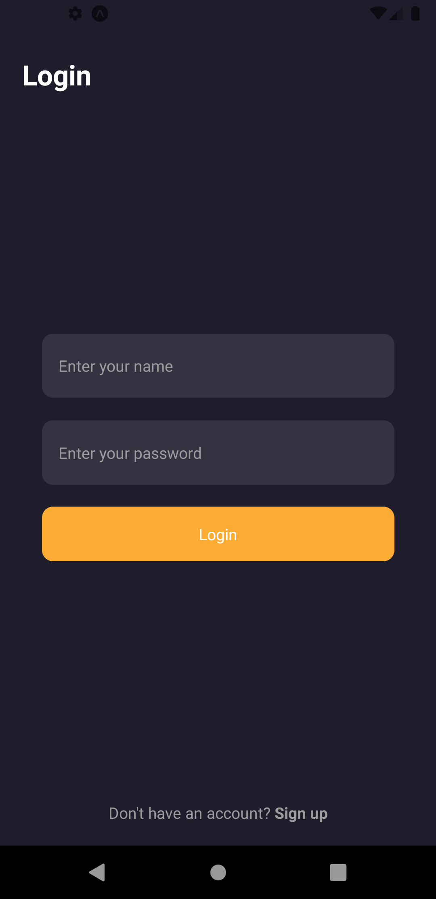 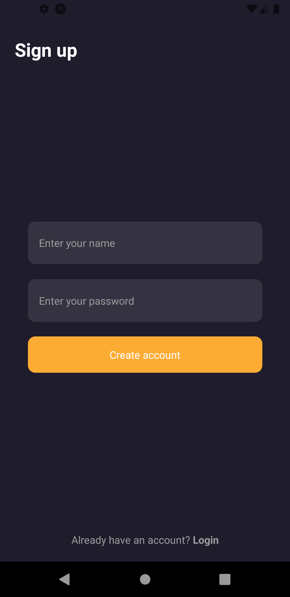 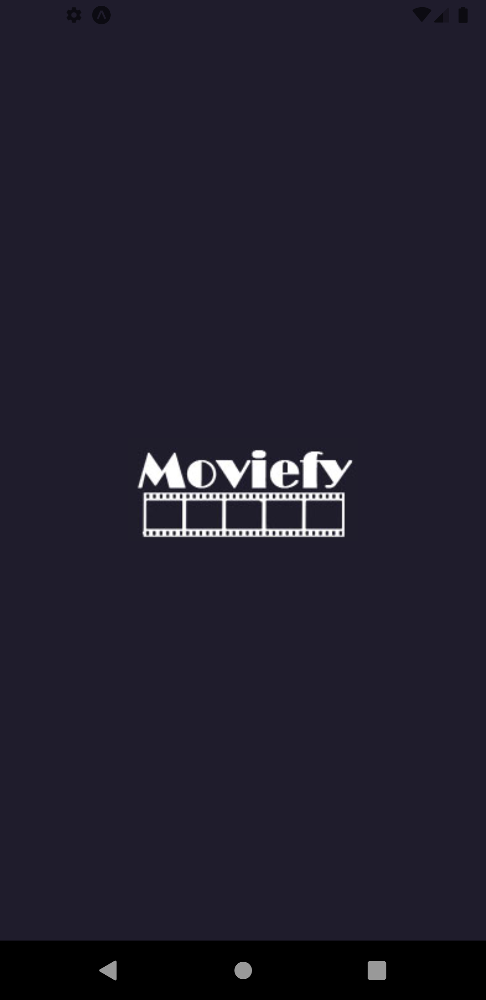
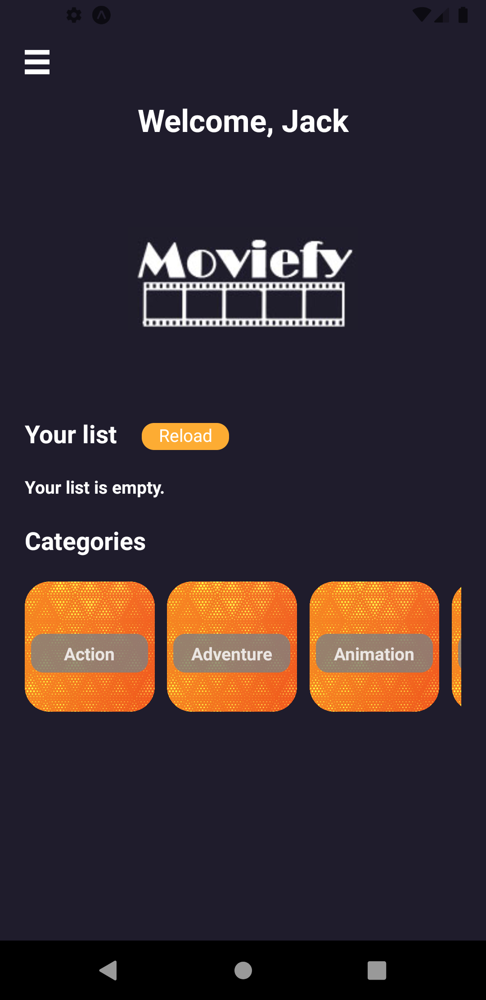 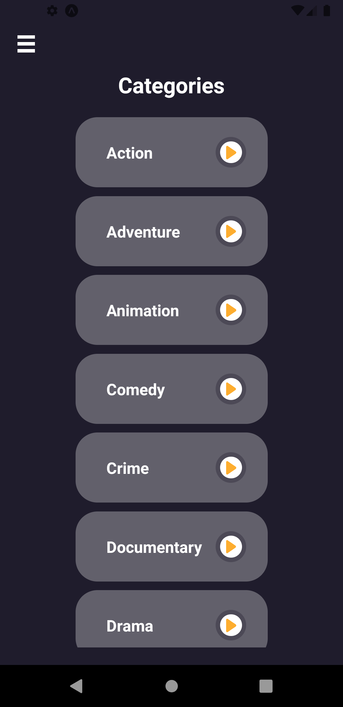 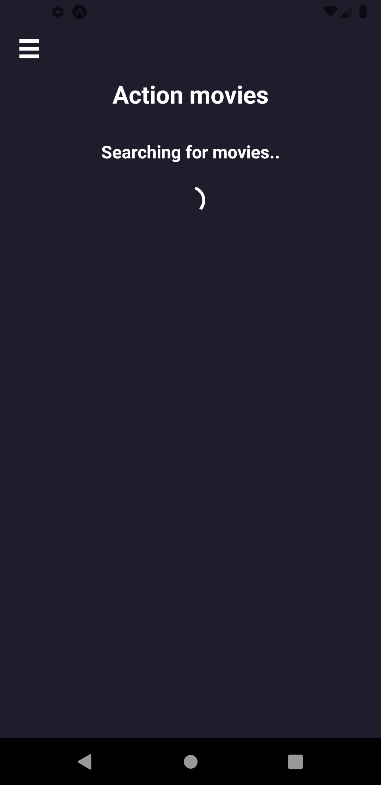
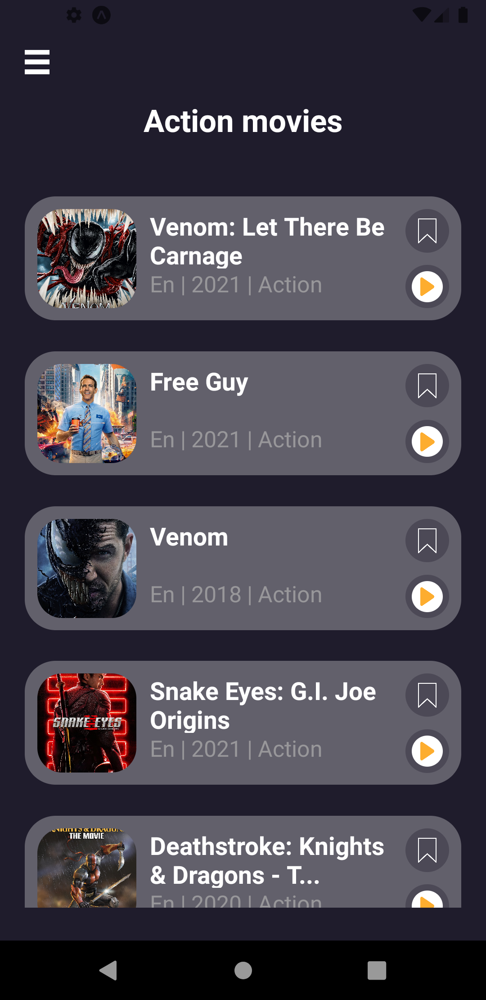 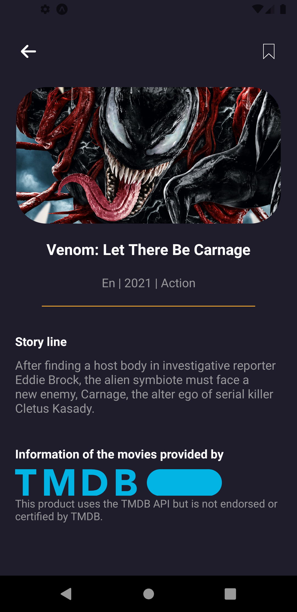 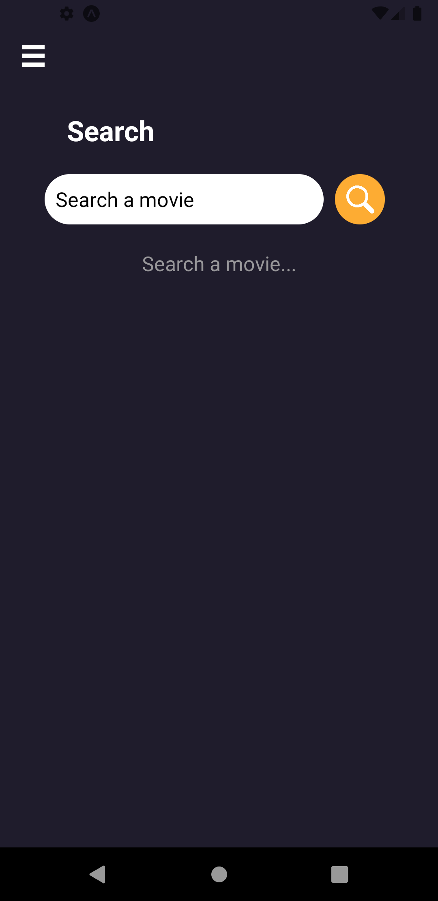 
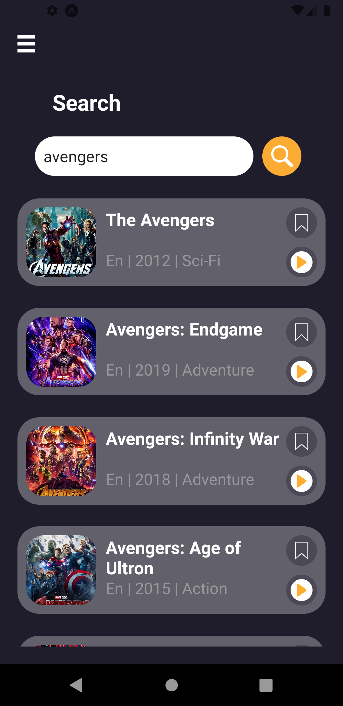 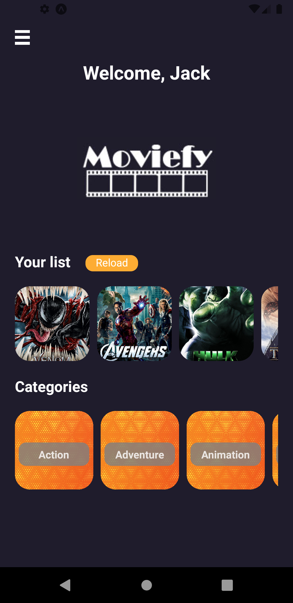 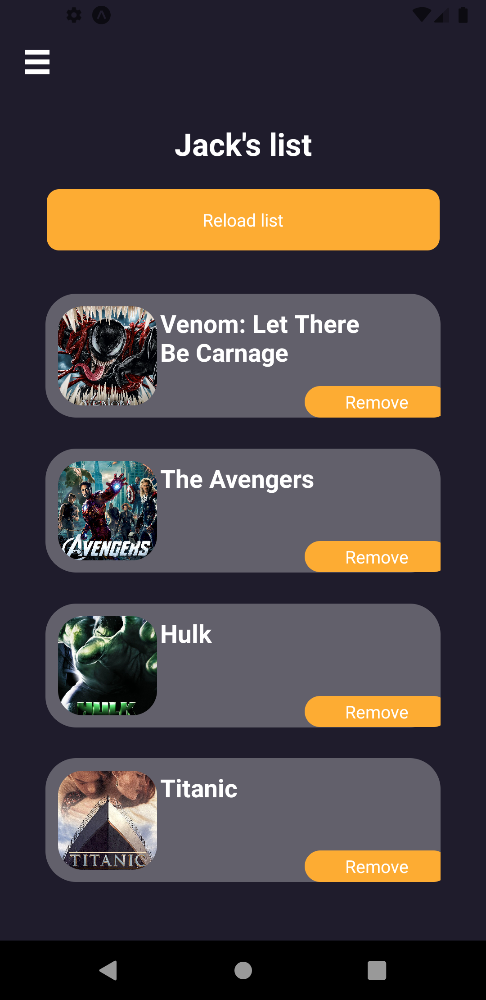

## Attribution
The movies are fetched from TMDB (data of movies, categories and the images of the movies). 

This application uses icons made by <a href="https://www.freepik.com" title="Freepik">Freepik</a> from <a href="https://www.flaticon.com/" title="Flaticon">www.flaticon.com</a> and <a href='https://www.freepik.com/vectors/background'>Background vector created by vector_corp - www.freepik.com</a>. The hamburger menu icon is from <a href="https://png.is/f/call-610-465-white-hamburger-menu-icon-png/m2i8G6G6b1m2A0G6-201907232310.html">png.is</a>
